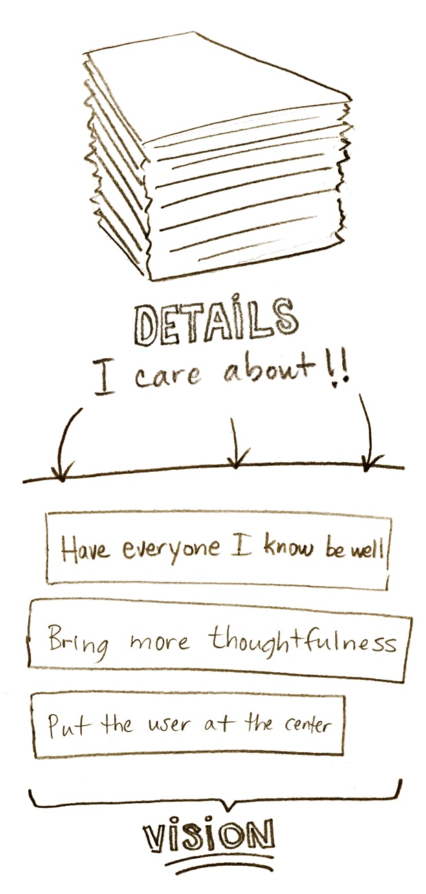
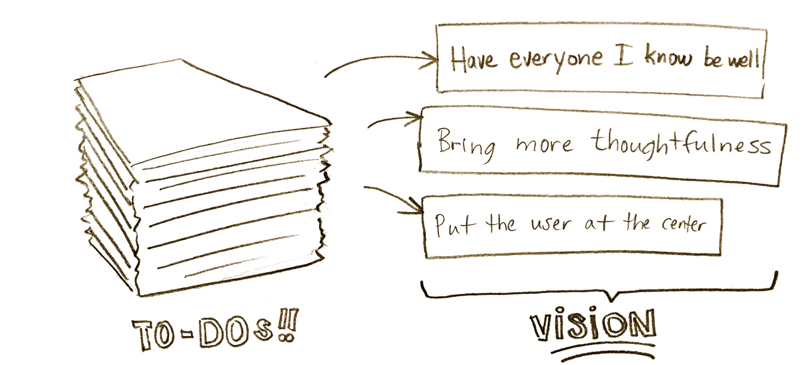

<mark>Do you have a vision for doing bigger things, but it's competing with all those other things you care about?</mark> Or how about this: are you making promises with yourself that you can't seem to keep? If that's your situation, here's something that could help:
{: .switch-away-from }

# The Objectives Course
{: #course-title }

**A 10-week course on writing _have-done_ lists: a clever way to write objectives to get on top of all the little things you care about _while_ helping you advance on that bigger vision**

A first group started on Feb. 26 (sign-ups are closed for that one), and if all goes well, other groups will be available in the coming months.

[Sign up to be notified of future launches](#get-started) or check below for more details...

  
  

***

Hi. My name is [Pascal Laliberté](/) and I'm offering a course **about a trick I've learned: how to write objectives in a way I call _have-done lists_**.

## Here's what **_have-done lists_** look like:
{: .have-done-lists-heading }

### Before the end of the morning, I'll have:

* Made sure everyone in the family started their day feeling good
* Written the next example for the course
  * Made a first draft of the evolution of the example's have-done list
  * Written the narrative surrounding the example's have-done list
* Done the 7-minute workout

### Before the end of the meeting:

* ### I'll have:
  * Obtained a change in the way we work
    * Communicated my concern with the way it's working right now
    * Shared another alternative
* ### He'll have:
  * Obtained an authentic and frank discussion
  * Obtained a key player on the delivery of the new project

### Before the end of the month, I'll have:

* Tended to the small tasks around the house
* Advanced in preparing for handling an emergency situation
  * Had a first fire drill that was clear, encouraged personal responsibility and was light-hearted
* Fixed the squeaky door to the garage

### I've found that _have-done lists_ let me...

* **<mark>Picture "perfection"</mark>**: I like imagining the best way something can become, and _have-done lists_ encourage me to do that, while letting me...
* **<mark>Prioritize ruthlessly</mark>** to find the smallest possible, most impactful thing I can do first, which allow me to...
* **<mark>Have quick successes</mark>** that help me get to fun stuff later on, which help me...
* **<mark>Get away from the always-urgent</mark>** and closer to the important, less-urgent goals, which freed up my attention and energy to...
* **<mark>Tackle the most complex situations</mark>** and turn them around, in my family, in my work, with my friendships, where it matters, which, in the end, let me...
* **<mark>Care more</mark>** about [pretty much everything you care about][godeepineverything], but especially about what is bigger, more important.
{: .lets-me-list }

[godeepineverything]: https://medium.com/subtlety-in-faith/go-deep-on-everything-3bdf4db97134#.g8naua5nw

### I turn to _have-done lists_...

* *...instead of*{: .instead-of-prefix } **giving too much attention to urgent to-dos.** Have-done lists require you to _start with the end in mind_, forcing you to remove yourself from the urgency.
* *...instead of*{: .instead-of-prefix } **letting guilt accumulate** about things I'm not giving my attention to. Every day you can start fresh with a new list and make hard decisions about what's in and what's out. Beat the guilt!
* *...instead of*{: .instead-of-prefix } **writing to-do lists**, [because not everything that matters is a to-do](https://medium.com/@pascallaliberte/what-to-dos-cant-do-9e4568c7a901#.t9c97ucct). Sometimes what matters is to adopt a posture, or to listen, or to receive, or to connect. Have-done lists allow for those, no problem.
* *...instead of*{: .instead-of-prefix } **using different techniques for different time scales**. Have-done lists work on tiny time scales (_before my meeting with my boss, I'll have..._) as well as huge time scales (_before my kids leave for university, I'll have..._)
* *...instead of*{: .instead-of-prefix } **compromising on my vision**, since _there is a way_ to get the concrete stuff done while, _at the same time_, match my [vision of how things should be...](https://medium.com/@pascallaliberte/your-ideals-and-their-future-c0cd9966801c#.ci5yc7ss2)
{: .instead-of-list }

[Ok, let me know the next time the course will be made available](#get-started){: .sign-up-link }
{: .sign-up-link-wrapper }

## Structure of the course
{: .get-started-heading }

* The course will run over 10 weeks.
* **Every week, you'll receive an email** with an example situation (we'll pretend you're the person in the situation). We'll use _have-done lists_ to help write some objectives to get progress on that example situation. Here's an example [article which resembles how an example will be delivered](https://medium.com/@pascallaliberte/install-those-resolutions-962f7b52ac3b#.fwjhfv7px) in your email.
* Week after week, example by example, you'll **unlearn what leads to stale outcomes**, and you'll learn new ways to write objectives that get you what you really want. It'll be like **learning a new language**.
* Also, with each email, I'll encourage you to share your objectives with me so I can give you feedback. Just reply back to share your own list, and I'll help you by **giving you quick ideas and suggestions to improve the way your objectives are written**.
* A first group started on Feb. 26. Stay tuned for future launches.
* The course is offered at a fixed price, fully refundable if you're not satisfied.
{: .get-started-checklist }

[Sign up to be notified of future launches](#get-started){: .sign-up-link }
{: .sign-up-link-wrapper }

***

## Your _have-done_ lists for the course

### By the end of your first few weeks in the course, by putting in the effort, you will have:

* Started developing your own new _language_ for describing what you envision as a success
* Obtained a surprising result in one area of your life
* Realized, on a few occasions, how you used to tackle your problems, and how to improve your approach next times

### By the end of the course, after sticking with it, you will have:

* Noticed you had developed some new instincts when planning your next steps, that habits had formed
* Obtained a couple surprising results in unexpected areas of your life (personal, professional, family, friends)
* Felt satisfaction, on a few occasions, at having been able to picture "perfection" and having advanced a little toward it
* Developed a better appreciation of your natural tendencies and your default ways of tackling problems
* Been exposed to a variety of different ways to write objectives: time boxing, how to iterate on a list, new verbs to use at the beginning of each objective, how to group objectives, what questions to ask yourself to get unstuck, applying the technique on different time scales

***

## Sign up to be notified of future launches
{: #get-started }

A first group started on Feb. 26, but stay tuned for future launches in the coming months.



## A personal note

I've relied on this way of writing objectives for much of the breakthroughs I've had in the last long while. By visualizing a better situation, and focusing on the smallest thing I could do to improve the situation, I found some surprising ways to make things work out with less effort. Put in the effort to re-write your options with these objectives lists, and you'll likely be surprised too.

If you've got some questions, look below for my email address.

Keep going on your vision!  
Sincerely,

--
**Pascal Laliberté** 
<mailto:the-objectives-course@pascallaliberte.me>
